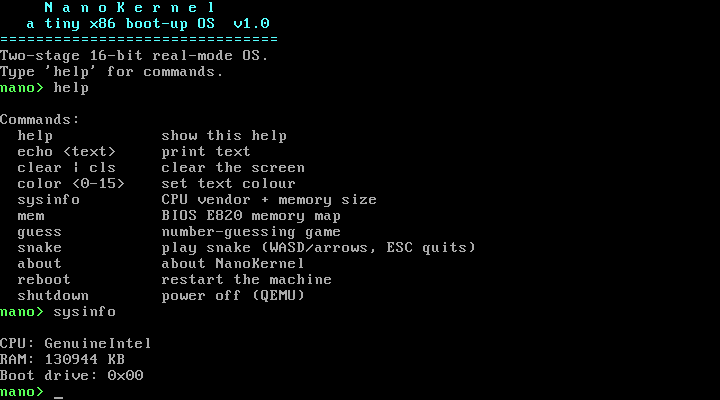
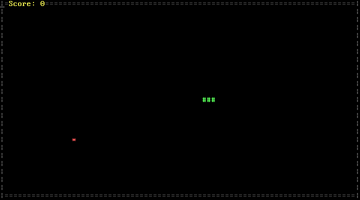

# NanoKernel

> A tiny two-stage x86 operating system that boots from a 512-byte boot sector into a real interactive shell — with system-info tools and two built-in games. Written from scratch in NASM assembly.



## Stack

- **Language:** x86 real-mode assembly (NASM)
- **Firmware interface:** BIOS interrupts — `int 0x10` (video), `int 0x16` (keyboard), `int 0x13` (disk), `int 0x15` (memory), `int 0x1A` (timer), `CPUID`
- **I/O:** direct VGA text buffer (`0xB800`) + a 16550 UART serial console (COM1)
- **Tooling:** [NASM](https://www.nasm.us/) to assemble, [QEMU](https://www.qemu.org/) to run

## Description

NanoKernel started life as a single 512-byte boot-sector shell (still preserved in
[`legacy/`](legacy/boot_shell.asm)). It has since grown into a **two-stage** system: a small boot
sector (`boot/stage1.asm`) loads a larger second-stage kernel (`kernel/stage2.asm`) from disk and
jumps to it. Stage 2 is a proper little text-mode environment — its own console with scrolling and
colour, a command shell, BIOS-backed system-info commands, and two games — all in real mode,
no OS underneath.

Every character printed is also mirrored to the serial port, so NanoKernel can be driven and
scripted over COM1 as well as from the keyboard.

## Features

- **Two-stage bootloader** — a valid 512-byte boot sector that loads the kernel sector-by-sector (handling track/head boundaries) and hands off control.
- **Text-mode console** — direct `0xB800` writes with a hardware cursor, line scrolling, backspace, and selectable colour.
- **Command shell** with:
  - `help` — list commands
  - `echo <text>` — print text
  - `clear` / `cls` — clear the screen
  - `color <0-15>` — set the text colour
  - `sysinfo` — CPU vendor via `CPUID`, RAM size via BIOS `int 15h/E801`, boot drive
  - `mem` — full BIOS `E820` memory map (base / length / type)
  - `about` — banner and credits
  - `reboot` — restart via the 8042 controller
  - `shutdown` — ACPI power-off (QEMU)
- **Games:**
  - `guess` — number-guessing game (1–100) with higher/lower feedback
  - `snake` — a real-time text-mode snake with score, growing tail, and food



## How to Build / Run

You need `nasm` and `qemu`.

```bash
# build the bootable floppy image -> build/nanokernel.img
./build.sh           # or: make

# run it in QEMU
make run             # or: qemu-system-i386 -drive file=build/nanokernel.img,format=raw,if=floppy
```

### Drive it over serial

NanoKernel's shell reads from COM1 as well as the keyboard, so you can script it:

```bash
qemu-system-i386 -drive file=build/nanokernel.img,format=raw,if=floppy \
                 -display none -serial tcp:127.0.0.1:4455,server,nowait
# then connect to 127.0.0.1:4455 and type commands
```

## Project layout

| Path | What it is |
|------|------------|
| `boot/stage1.asm` | 512-byte boot sector; loads and jumps to stage 2 |
| `kernel/stage2.asm` | the mini-kernel: console, shell, sysinfo, games |
| `build.sh` / `Makefile` | assemble the two stages into a bootable image |
| `legacy/boot_shell.asm` | the original single-sector shell NanoKernel grew from |

## License

Released under the [MIT License](LICENSE).
